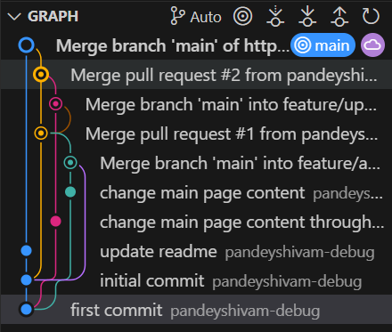

# git-assignment3

## Merge conflict #1 (feature/add-content)

### Conflict resolved and branch merged

## Merge conflict #2 (feature/update-styling)

### Conflict resolved and branch merged

## Explanation of how the conflict was resolved--
#### The conflict occured in the first place because both the branches "feature/add-content" and "feature/update-styling" had made changes in the same section of the same file.

### Conflict 1 - merging "feature/add-content" with "main"
### Conflict 2 - merging "feature/update-styling" with "main"

### Steps taken to resolve the conflicts-
#### 1. reviewed the changes in the github editor
#### 2. removed the previous content and kept the new text from the incoming branch

## Branch graph
